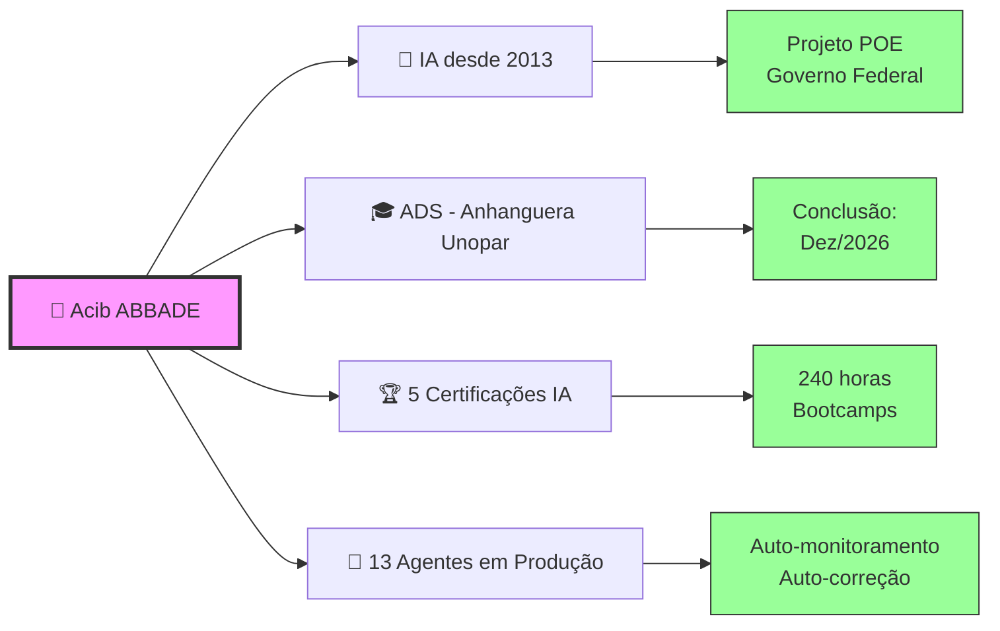
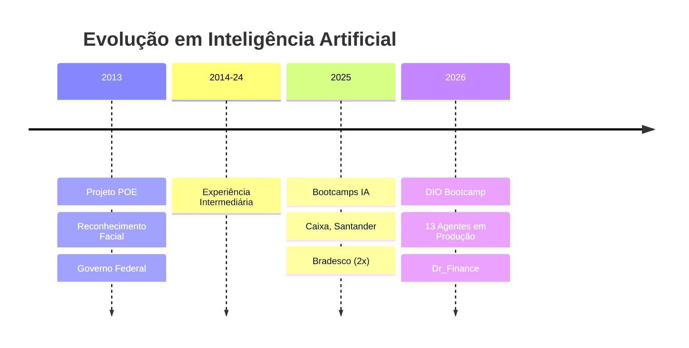
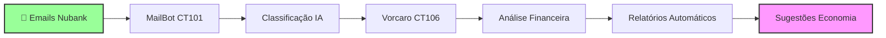
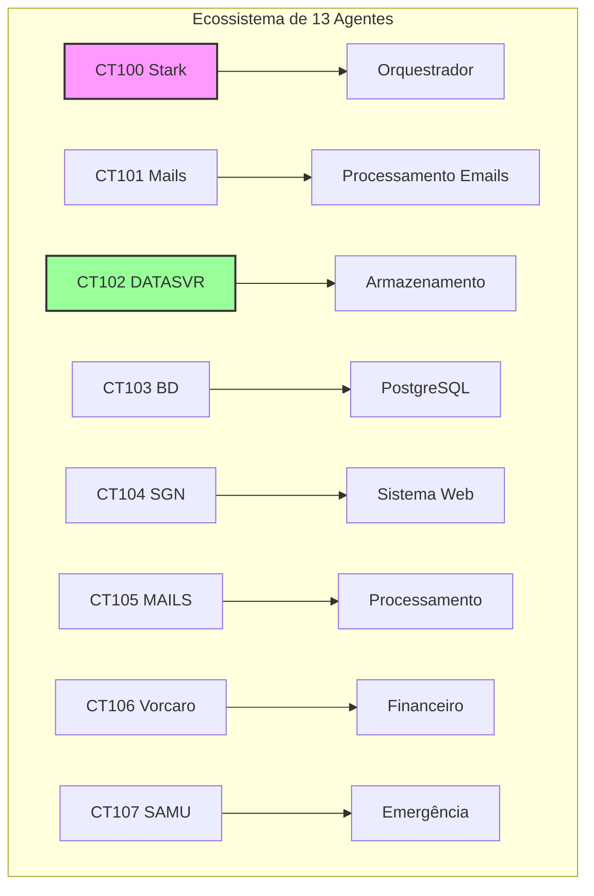
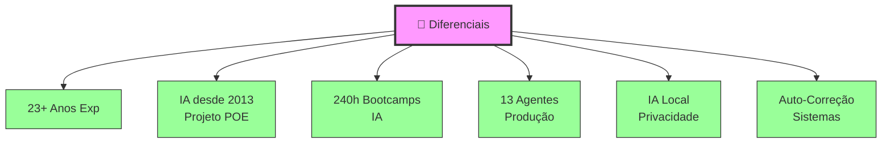

# 👋 Olá, sou Acib ABBADE!

## 🎯 Arquiteto de Soluções Cognitivas

---

## 📖 Sobre Mim

> **Arquiteto de Soluções Cognitivas** com **23+ anos de experiência** em tecnologia, especializado em **sistemas multi-agentes com memória persistiva** e **IA local com privacidade total**.

---

## 🎓 Formação Acadêmica

| Curso | Instituição | Status | Conclusão |
|-------|-------------|--------|-----------|
| **Análise e Desenvolvimento de Sistemas** | Anhanguera Unopar | 🟢 Último Semestre | **Dezembro/2026** |

---

## 🏆 Certificações em Inteligência Artificial

### **Bootcamps Bancários (240 horas)**

| Instituição | Programa | Carga Horária | Ano |
|-------------|----------|---------------|-----|
| 🏦 **Caixa Econômica Federal** | Bootcamp de Inteligência Artificial | 60 horas | 2025-2026 |
| 🏦 **Santander** | Bootcamp de Inteligência Artificial | 60 horas | 2025-2026 |
| 🏦 **Banco Bradesco** | GenAI & Dados | 60 horas | 2026 |
| 🏦 **Banco Bradesco** | Inteligência Artificial | 60 horas | 2025-2026 |
| 💻 **DIO** | Bootcamp Lab BIA do Futuro | - | 2026 |

---

## 🚀 Minha Jornada em IA

### **📍 Marcos Importantes:**

| Ano | Marco | Descrição |
|-----|-------|-----------|
| **2013** | 🎯 **Primeiro Contato com IA** | Projeto POE - Reconhecimento Facial em Tempo Real (Governo Federal) |
| **2025-26** | 📚 **4 Bootcamps de IA** | Caixa, Santander, Bradesco - 240 horas totais |
| **2026** | 🤖 **Produção Real** | 13 agentes autônomos especializados em produção |

---

## 💼 Projetos em Destaque

### **1. Dr_Finance - Agente Financeiro Cognitivo**

| Campo | Informação |
|-------|------------|
| **Descrição** | Agente financeiro inteligente que analisa gastos automaticamente |
| **Tecnologias** | Proxmox, OpenClaw, Ollama, Python, Flask |
| **Diferencial** | IA local com privacidade total - dados não saem do servidor |
| **Status** | ✅ Entregue (Abril 2026) |
| **GitHub** | [acibabbadecastro/dr-finance](https://github.com/acibabbadecastro/dr-finance) |

---

### **2. Multi-Agentes OpenClaw (13 Containers)**

| Campo | Informação |
|-------|------------|
| **Descrição** | Ecossistema de 13 agentes especializados operando 24/7 |
| **Infraestrutura** | Proxmox VE, 13 Containers LXC (CT 100-112) |
| **Recursos** | Auto-monitoramento, auto-correção, documentação automática |
| **Memória** | Compartilhada via DATASVR, atualização a cada 4h |
| **Status** | ✅ Produção (desde 2025) |

---

### **3. Kit Hub - Documentação Proxmox**

| Campo | Informação |
|-------|------------|
| **Descrição** | 11 arquivos de documentação + scripts de automação Proxmox |
| **Objetivo** | Compartilhar conhecimento em infraestrutura cloud |
| **GitHub** | [acibabbadecastro/kit-hub](https://github.com/acibabbadecastro/kit-hub) |
| **Status** | ✅ Público |

---

## 🛠️ Stack Técnico

### **Linguagens & Frameworks:**

### **Infraestrutura:**

### **IA & Machine Learning:**

### **Ferramentas:**

---

## 🔬 Linhas de Pesquisa Atuais

| Área | Descrição | Status |
|------|-----------|--------|
| **Memória Persistiva** | Vector embeddings, RAG, memory compression | 🔬 Em pesquisa |
| **Cloud vs Local** | Benchmarks de desempenho e custo-benefício | 🔬 Em pesquisa |
| **Multi-Agentes Autônomos** | Coordenação, shared memory, task delegation | 🚀 Produção |
| **Arquiteturas Cognitivas** | Sistemas que aprendem e evoluem | 🔬 Em pesquisa |
| **Auto-Correção** | Detecção e correção automática de falhas | 🚀 Produção |

---

## 🎯 Áreas de Atuação

| Área | Especialidade | Nível |
|------|---------------|-------|
| **🤖 IA & Multi-Agentes** | Arquitetura, implementação, pesquisa | ⭐⭐⭐⭐⭐ |
| **🌐 Redes** | Cabeamento, VLANs, switches, VPN | ⭐⭐⭐⭐⭐ |
| **🐧 Linux** | Administração, servidores, otimização | ⭐⭐⭐⭐⭐ |
| **🔐 VPN & Remote Office** | Projeto, configuração, múltiplos acessos | ⭐⭐⭐⭐⭐ |
| **💾 Servidores de Dados** | Manutenção, backup, monitoramento | ⭐⭐⭐⭐⭐ |
| **🔧 Hardware** | Manutenção, upgrade, diagnóstico | ⭐⭐⭐⭐⭐ |

---

## 🏆 Diferenciais Competitivos

| Diferencial | Descrição |
|-------------|-----------|
| ✅ **13+ Anos em IA** | Desde Projeto POE (2013) - Reconhecimento Facial |
| ✅ **Produção Real** | 13 agentes autônomos operando 24/7 |
| ✅ **IA Local** | Privacidade total - dados não saem do servidor |
| ✅ **Auto-Correção** | Sistemas que se monitoram e corrigem sozinhos |
| ✅ **240h em IA** | 4 bootcamps bancários + DIO |
| ✅ **Perfil Completo** | Hardware + Redes + IA + Pesquisa |

---

## 📫 Como Me Encontrar

| Canal | Link/Informação |
|-------|-----------------|
| **📧 Email** | [abbade@outlook.com](mailto:abbade@outlook.com) |
| **📱 Telegram** | [@Acib_Abbade](https://t.me/Acib_Abbade) |
| **💼 LinkedIn** | [in/acibabbade](https://linkedin.com/in/acibabbade) |
| **🐙 GitHub** | [acibabbadecastro](https://github.com/acibabbadecastro) |
| **📍 Localização** | São Paulo, SP - Brasil |
| **🕐 Timezone** | UTC-3 (Brasília) |

---

## 💡 Disponível Para

| Tipo | Interesse |
|------|-----------|
| 🤖 **Engenheiro de IA/ML** | ✅ Alto |
| ⚙️ **DevOps / SRE** | ✅ Alto |
| 💻 **Desenvolvedor Fullstack** | ✅ Alto |
| 📊 **Analista de Dados** | ✅ Médio |
| 🤖 **Automação & Scripts** | ✅ Alto |
| 🏗️ **Consultoria em Infraestrutura** | ✅ Alto |
| 📚 **Treinamento Técnico** | ✅ Médio |

---

## 🎤 Pitch Profissional

> **"Sou Arquiteto de Soluções Cognitivas.**
>
> **Trabalho com IA desde 2013 — comecei com reconhecimento facial no Projeto POE (Governo Federal).**
>
> **Fiz 240 horas em bootcamps de IA (Caixa, Santander, Bradesco).**
>
> **Hoje rodo 13 agentes autônomos em produção — sistemas que se auto-monitoram, auto-corrigem e aprendem continuamente.**
>
> **Não sou de agora. Vivo IA há 13 anos."**

---

## 📊 Estatísticas do GitHub

<!-- GitHub Stats - Descomente quando o repositório estiver ativo -->
<!--

-->

---

## 🙏 Obrigado pela Visita!

> *"Tecnologia é melhor quando é invisível — funciona tão bem que você nem percebe que está lá."*

Se você chegou até aqui, obrigado pelo interesse! Estou sempre aberto a discutir novos projetos, oportunidades de colaboração ou apenas trocar ideias sobre tecnologia, IA e automação.

**Sinta-se à vontade para entrar em contato!** 🚀

---

  <strong>⭐ Se gostou do meu perfil, deixe uma star nos meus repositórios!</strong>

  <em>Desenvolvido com 💜 por Acib ABBADE</em>

  <strong>🎓 Anhanguera Unopar | 🏆 240h em IA | 🤖 13 Agentes em Produção | 🚀 IA desde 2013</strong>

