# 👋 Olá, sou Acib ABBADE!

---

## 🎓 Sobre Mim

> **Arquiteta de IA & Desenvolvedora Multi-Agentes** com **23+ anos de experiência** em tecnologia, especializada em criar soluções inteligentes que unem infraestrutura, automação e inteligência artificial.

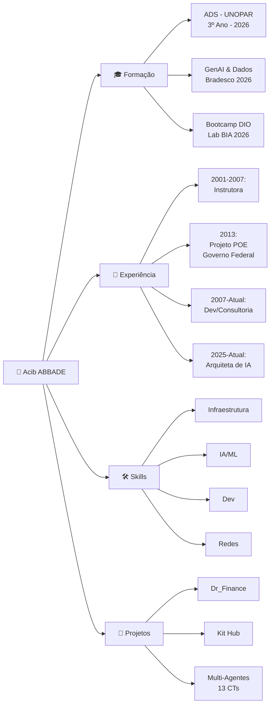

---

## 💼 Experiência Profissional

### 🏆 **Projeto POE (2013)** - Governo Federal
**Plataforma de Operações Elevadas - Copa 2013/2014**

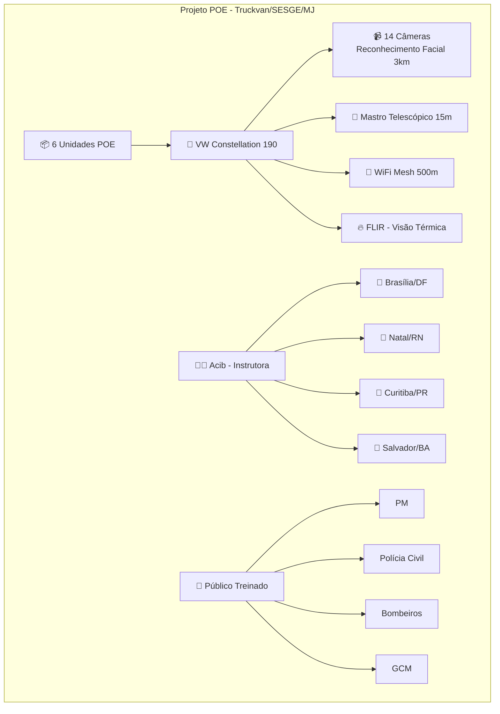

**Minha Função:**
- ✅ Freelancer para treinamento de sistemas
- ✅ Instrutora da equipe + instrutora de turmas
- ✅ Designada para 4 estados (DF, RN, PR, BA)
- ✅ Treinamento de sistemas de vigilância de alta tecnologia

---

### 📚 **Instrutora de Informática (2001-2007)**
**6 anos de experiência em ensino de tecnologia**

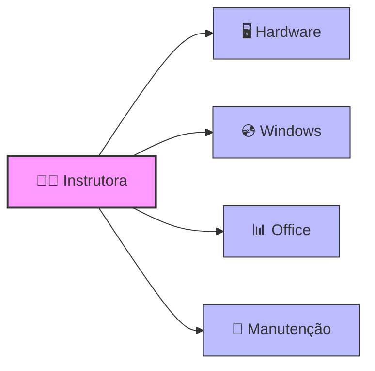

---

### 🤖 **Arquiteta de IA (2025-Atual)**
**Especialista em sistemas multi-agentes e IA local**

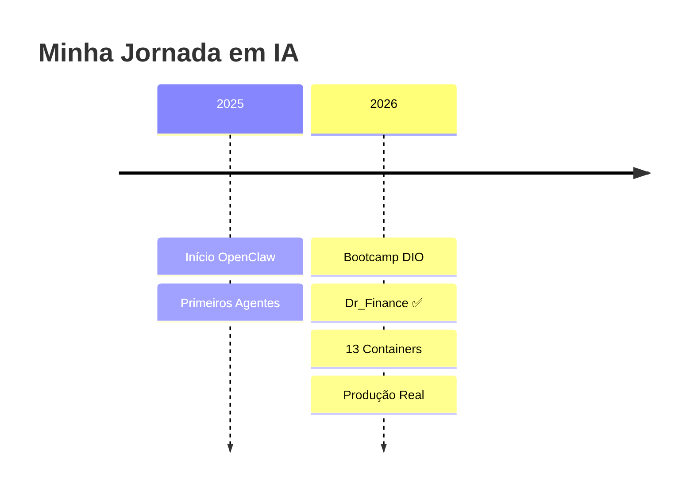

---

## 🛠️ Stack Técnico

### 🌐 **Redes de Computadores** ⭐⭐⭐⭐⭐

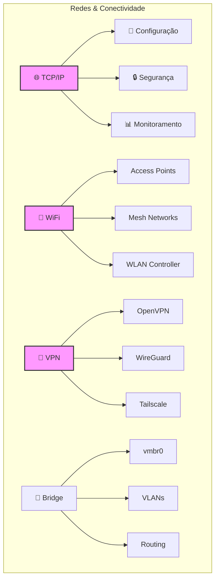

**Experiência Prática:**
- ✅ Redes isoladas (192.168.0.0/24)
- ✅ Bridge configuration (vmbr0)
- ✅ VLANs e routing
- ✅ WiFi Mesh (500m alcance - Projeto POE)
- ✅ VPN (OpenVPN, Tailscale)

---

### 🖥️ **Administração de Servidores** ⭐⭐⭐⭐⭐

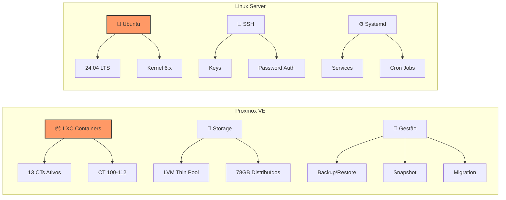

**Experiência Prática:**
- ✅ **Proxmox VE:** 13 containers LXC em produção
- ✅ **Storage:** LVM, thin pool, expansão dinâmica
- ✅ **Backup:** rsync, Samba, backup automático 4h
- ✅ **SSH:** Configuração, keys, segurança
- ✅ **Systemd:** Services, timers, logs

---

### 🤖 **IA & Multi-Agentes** ⭐⭐⭐⭐⭐

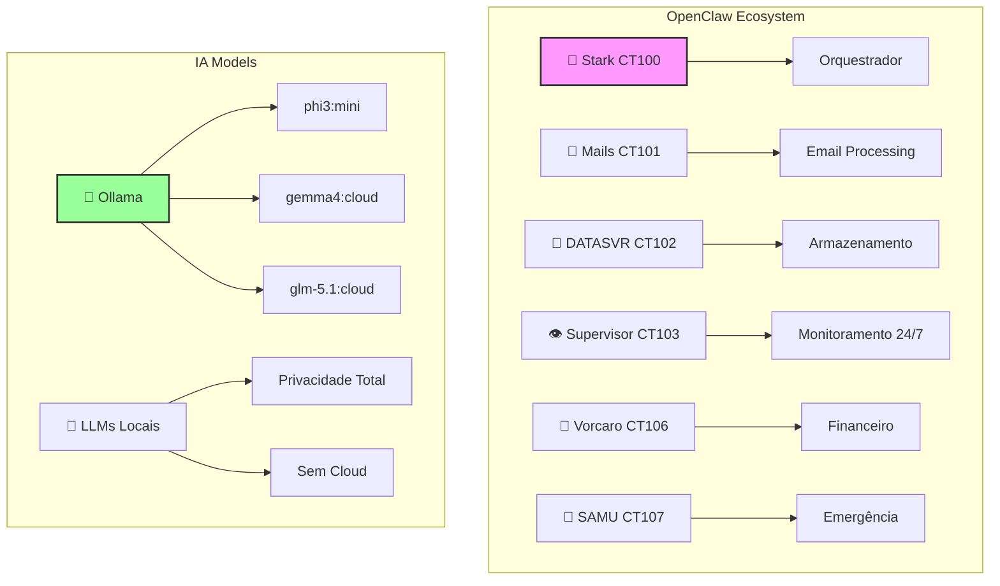

**Projetos em Produção:**
- ✅ **Dr_Finance:** Agente financeiro inteligente
- ✅ **Kit Hub:** 11 arquivos de documentação Proxmox
- ✅ **Multi-Agentes:** 13 containers especializados
- ✅ **API SMS:** Flask + Android Gateway

---

### 🔌 **Arduino & IoT** ⭐⭐⭐⭐

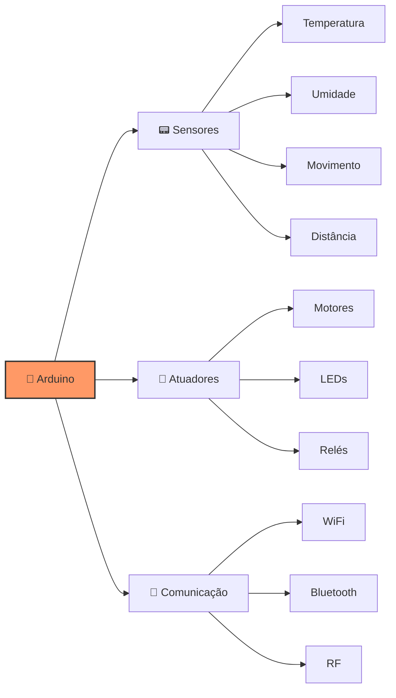

**Experiência Prática:**
- ✅ Programação de microcontroladores
- ✅ Sensores e atuadores
- ✅ Integração com sistemas embarcados
- ✅ Prototipagem rápida
- ✅ IoT com ESP8266/ESP32

---

### 💻 **Desenvolvimento** ⭐⭐⭐⭐⭐

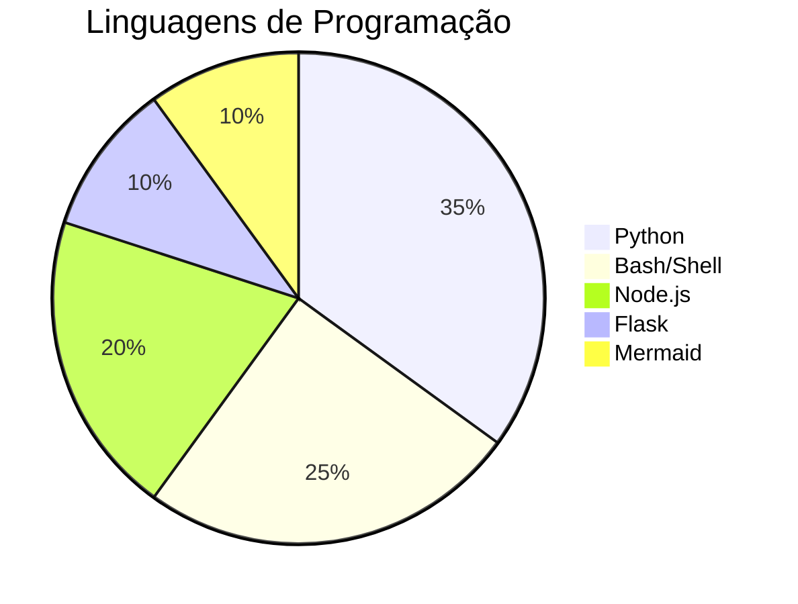

**Principais Projetos:**
- ✅ Scripts de automação (Python, Bash)
- ✅ API REST (Flask)
- ✅ OpenClaw runtime (Node.js)
- ✅ Diagramas técnicos (Mermaid)

---

## 🚀 Projetos em Destaque

### 1️⃣ **Dr_Finance** - Agente Financeiro Inteligente

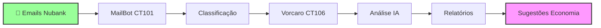

**Status:** ✅ Entregue (20/04/2026)  
**Techs:** Proxmox, OpenClaw, Ollama, Python, Flask, Mermaid

---

### 2️⃣ **Kit Hub** - Documentação Proxmox

**Conteúdo:**
- ✅ 11 arquivos de documentação
- ✅ Scripts de automação
- ✅ Tutoriais passo a passo

**GitHub:** https://github.com/acibabbadecastro/kit-hub

---

### 3️⃣ **Multi-Agentes OpenClaw**

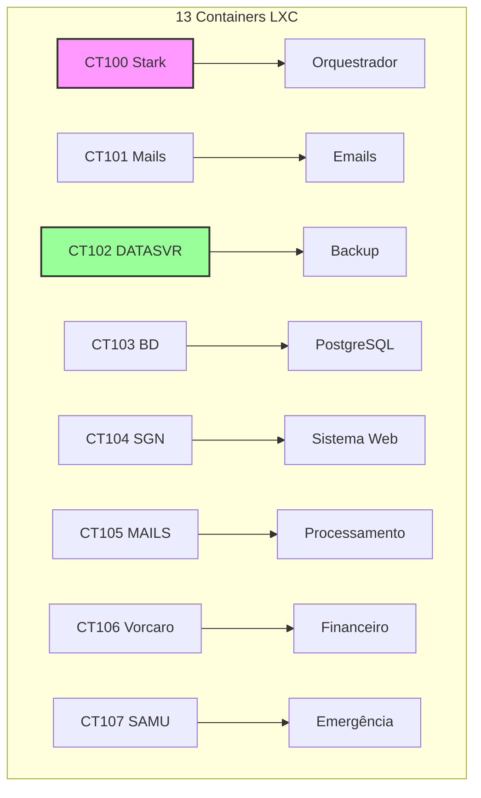

**Status:** ✅ Produção (13 containers ativos)

---

## 📊 Estatísticas do GitHub

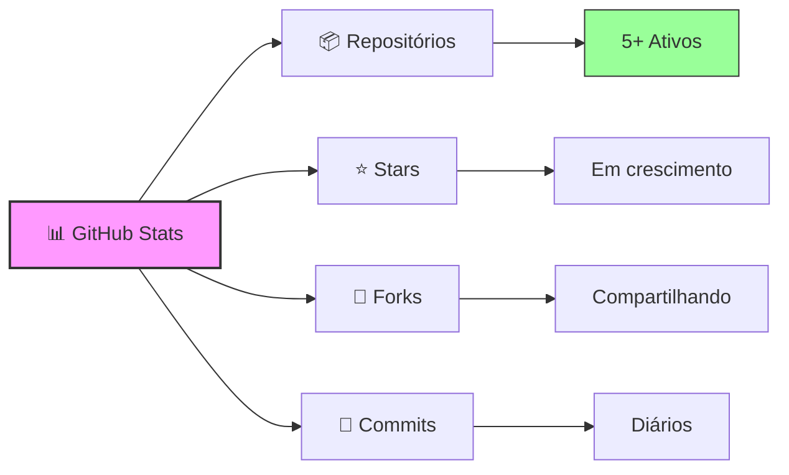

---

## 🎯 Disponível Para

| Área | Interesse |
|------|-----------|
| 🤖 **Engenheira de IA/ML** | ✅ Alto |
| ⚙️ **DevOps / SRE** | ✅ Alto |
| 💻 **Desenvolvedora Fullstack** | ✅ Alto |
| 📊 **Analista de Dados** | ✅ Médio |
| 🤖 **Automação & Scripts** | ✅ Alto |
| 🏗️ **Consultoria em Infraestrutura** | ✅ Alto |
| 📚 **Treinamento Técnico** | ✅ Médio |

---

## 💡 Diferenciais

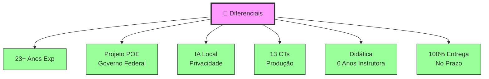

---

## 📫 Contato

| Canal | Link |
|-------|------|
| 📧 **Email** | [abbade@outlook.com](mailto:abbade@outlook.com) |
| 📱 **Telegram** | [@Acib_Abbade](https://t.me/Acib_Abbade) |
| 🔗 **GitHub** | [acibabbadecastro](https://github.com/acibabbadecastro) |
| 📍 **Localização** | São Paulo, SP - Brasil |
| 🕐 **Timezone** | UTC-3 (Brasília) |

---

## 🙏 Obrigado pela Visita!

> *"Tecnologia é melhor quando é invisível - funciona tão bem que você nem percebe que está lá."*

Se você chegou até aqui, obrigado pelo interesse! Estou sempre aberta a discutir novos projetos, oportunidades de colaboração ou apenas trocar ideias sobre tecnologia, IA e automação.

**Sinta-se à vontade para entrar em contato!** 🚀

---

  <strong>⭐ Se gostou do meu perfil, deixe uma star nos meus repositórios!</strong>

  <em>Desenvolvido com 💜 por Acib ABBADE</em>

